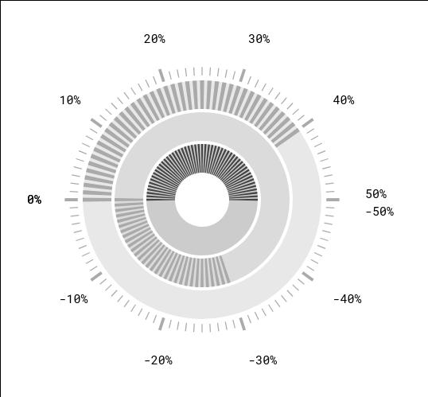
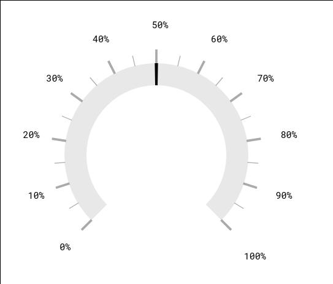

# D3 Simple Gauge v0.6

## What's This?

It's a basic gauge powered by D3. Some features are negative numbers, overflow color indications, as well as the wide range of customization options through variables.



## Download

[](https://raw.githubusercontent.com/igw-ted/gauge-poc/master/dist/Gauge.min.js)

## Dependencies

* D3 >= v4

## Getting Started with Development

1. Get the GIT repo:  
`git clone https://github.com/igw-ted/gauge-poc.git`

2. In the root of the project, get the resources needed via NPM:  
`npm install`

3. From the root directory, start the live development server:  
`node_modules/.bin/live-server`

4. The development server runs at port 8080:  
`http://localhost:8080/src`

5. Make edits to `src/Gauge.js` and `src/index.html`, then run the dist script from the root of the project:  
`grunt dist`

6. Use the minified version for your project. It's ES5 and thus compatible with older browsers. It's also minified, so it uses less bandwidth at request.  
`dist/Gauge.min.js`

## Triggers

| Variable      | Default | Possible Values | Description   |
|-|-|-|-|
| `rootElement` | *None* | Any element ID | The root element where the gauge will generate. Replaces the content of the element. |
| `labelElement` | *None* | Any element ID | The element where the label will be added. Replaces the content of the element. |
| `width` | `300` | Any natural number | The width of the gauge.
| `height` | `300` | Any natural number | The height of the gauge. |
| `tickSize` | `1` | Any natural number | The size of the tick. 1 means that the tick equals 1 and will generate 100 ticks in a gauge reaching from 0-100, 2 will generate 50 and so on. |
| `tickThickness` | `3` | Any natural number | The thickness of the tick. |
| `offset` | `0` | Any natural number | The offset of the gauge. The greater the number, the smaller the gauge. Good if you want to show multiple gauges inside one another. |
| `orientation` | `0` | Any integer  or orientationVar().[NORTH SOUTH EAST WEST] | From which rotation the gauge should start to generate. |
| `unit` | *None* | Anything | The unit to show after the data in the label. |
| `minValue` | `-50` | Any real number | The minimum allowed data value. |
| `maxValue` | `50` | Any real number | The maximum allowed data value. |
| `allowOverflow` | `true` | `[true false]` | Whether or not to allow the gauge data to overflow and keep on filling the gauge above the maxValue. |
| `allowUnderflow` | `true` | `[true false]` | Whether or not to allow the gauge data to negatively overflow and keep on filling the gauge below the minValue. |
| `color` | `"#aaa"` | Any color in the hex/rgb/rgba format. | The color to fill the gauge with. |
| `overflowColor` | `"#aaa"` | Any color in the hex/rgb/rgba format. | The color to fill an overflowed gauge with. |
| `underflowColor` | `"#aaa"` | Any color in the hex/rgb/rgba format. | The color to fill an underflowed gauge with. |
| `showTickLabels` | `false` | [true false] | Whether or not to show tick labels. |
| `tickModulus` | `2` | Any natural number | The frequency of the tick label using tickValue % tickModulus = 0 |
| `bigTickModulus` | `10` | Any natural number | The frequency of the tick label using tickValue % tickModulus = 0 |
| `data` | *None* | Any real number | The data to show in the gauge. |
| `debug` | `undefined` | Anything | Triggers the debug. If it's not defined the debug is off. Otherwise it's on. |
| `background` | `rgba(0,0,0,0)` | Any color in the hex/rgb/rgba format. | Sets the background of the gauge. |
| `backgroundFill` | `"maxDegrees"` | `"maxDegrees"` or `"full"` | Sets the behavior of the background. |
| `tickColor` | `#aaa` | Any color in the hex/rgb/rgba format. | Sets the color of the ticks. |
| `tickCoverColor` | `#aaa` | Any color in the hex/rgb/rgba format. | The tick lines goes all the way into the center and is covered by a filled circle. This sets the color of that filled circle. |
| `tickCoverRadius` | `3.2` | Any number. | The tick lines goes all the way into the center and is covered by a filled circle. This sets the radius of that circle. |
| `tickLabelColor` | `#000` | Any color in the hex/rgb/rgba format. | The color of the tick lables. |
| `tickOffset` | `1` | Any number. | Offset the data in the gauge. Good for aligning the data with the ticks in different ways. Could also be used to animate the gauge while waiting for data. |
| `tickLabelFontFamily` | `"monospace"` | Any font family. | The font family for the tick lables. |
| `tickLabelSize` | `11px` | Any font size in any unit. | The font size for the tick lables. |
| `dataFillType` | `"undefined"` | Any value. | If set, the data will displayed with a needle instead of a filling gauge. |


## Methods

| Method | Possible Input Variables | Description | Example |
|-|-|-|-|
| `setConfig()` | An object of configs | You can add your configs by passing an object of configs to the `setConfig()` method. | `setConfig({width: 400, offset: 20, unit: "%"})` |
| `update()` | *None* | Call this to update the view. | `SetData(25); update();` |

## How To Use

Most of the settings have a default, but at the very least you need to set the `rootElement` and something to add into the `data` variable. If you plan to show labels, you need to set the `labelElement` and add the unit you plan to use, if any, to `unit` as well.

**HTML**    
```
<div id="gauge"></div>
```

**JS**
```
let gauge = new Gauge();
gauge.config({
        rootElement: "gauge",
        labelElement: "gauge-label",
        data: 40,
        color: "#444",
        debug: true
});
gauge.update();
```
